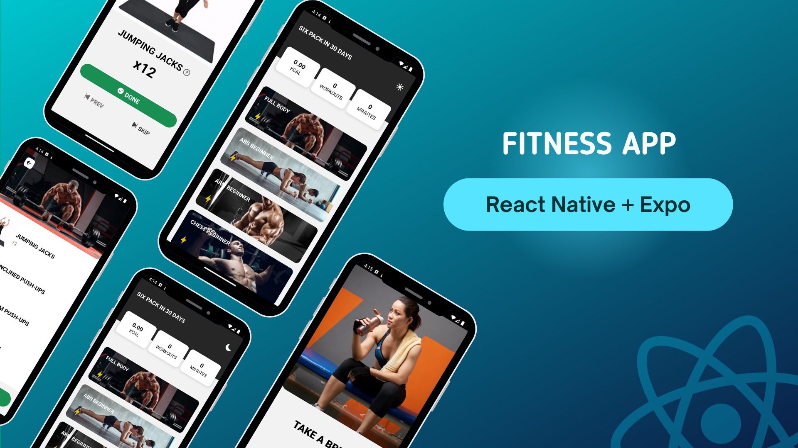

  
  
  
  
 
   

  <h2 align="center">React Native Fitness App</h2>

  In this project, I have created a Fitness App, The project is built using Expo, React Native, and React Native Navigation.

### Demo Screenshot

## Get Started

install dev dependencies

### `npm install`

## Then

Run The App

### `npm start`

Runs your app in development mode.

Open it in the [Expo app](https://expo.io) on your phone to view it. It will reload if you save edits to your files, and you will see build errors and logs in the terminal.

#### `npm run ios`

Like `npm start` / `yarn start`, but also attempts to open your app in the iOS Simulator if you're on a Mac and have it installed.

#### `npm run android`

Like `npm start` / `yarn start`, but also attempts to open your app on a connected Android device or emulator. Requires an installation of Android build tools (see [React Native docs](https://facebook.github.io/react-native/docs/getting-started.html) for detailed setup).

### Contact

If you want to contact me you can reach me at [LinkedIn](https://www.linkedin.com/in/geekyprashant/).

### License

This project is **free to use** and does not contain any license.
